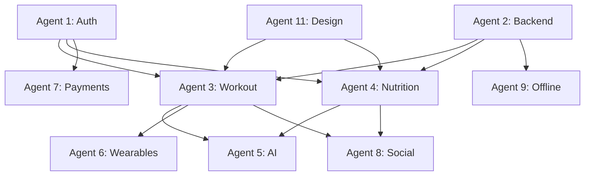

# CataLyft Development Sprint Roadmap - Complete Agent Plan

## Current Status: Sprint 3 (Week 6-7)
You are currently in Sprint 3 of the development timeline.

## Development Timeline Overview

```
Sprint 1: Foundation (Week 1-3) - COMPLETED ✅
Sprint 2: Core Features (Week 4-5) - IN PROGRESS 🔄
Sprint 3: Advanced Features (Week 6-7) - CURRENT 📍
Sprint 4: Polish & Social (Week 8-9) - UPCOMING
Sprint 5: Launch Prep (Week 10-11) - UPCOMING
Launch: Week 12 🚀
```

---

## SPRINT 1: Foundation Layer (Week 1-3) ✅ COMPLETED

### 🔐 Agent 1: Authentication System
**Branch**: `agent-1-authentication`
**Status**: ✅ Likely Complete
**Deliverables**:
- Supabase authentication integration
- Login/Signup/Password Reset screens
- OAuth (Google & Apple Sign In)
- Biometric authentication
- Session persistence
- Profile management

### 🔌 Agent 2: Backend Integration
**Branch**: `agent-2-backend`
**Status**: ✅ Likely Complete
**Deliverables**:
- API client with interceptors
- Zustand state management
- TypeScript models and database types
- Real-time subscriptions
- Offline queue
- React Query caching
- Optimistic updates

### 🎨 Agent 11: Design System
**Branch**: `agent-11-design-system`
**Status**: ✅ Likely Complete
**Deliverables**:
- Complete theme system (colors, typography, spacing)
- Core UI components (Button, Input, Card, Modal, Toast)
- Fitness-specific components (WorkoutTimer, RepCounter, MacroChart)
- Dark mode support
- Animations with Reanimated 2
- Loading states and skeletons

---

## SPRINT 2: Core Features (Week 4-5) 🔄 IN PROGRESS

### 🏋️ Agent 3: Workout Tracking System
**Branch**: `agent-3-workout-tracking`
**Dependencies**: Auth (Agent 1), Backend (Agent 2), Design System (Agent 11)
**Timeline**: 2 weeks
**Tasks**:
1. **Data Layer**:
   - Workout slice in store
   - Supabase tables: workouts, exercises, sets, workout_templates
   - CRUD operations service

2. **Screens**:
   - WorkoutListScreen (history & templates)
   - ActiveWorkoutScreen (live session)
   - ExerciseLibraryScreen (searchable)
   - WorkoutSummaryScreen (post-workout)

3. **Features**:
   - Start/pause/finish workout
   - Log sets with weight/reps/rest
   - Exercise search and creation
   - Rest timer with notifications
   - Personal records tracking
   - Workout templates
   - Calendar view

4. **Smart Features**:
   - Auto-increment suggestions
   - Previous workout comparison
   - Volume/intensity tracking
   - Muscle group analytics
   - Export to CSV/PDF

### 🍎 Agent 4: Nutrition Tracking System
**Branch**: `agent-4-nutrition-tracking`
**Dependencies**: Auth (Agent 1), Backend (Agent 2), Design System (Agent 11)
**Timeline**: 2 weeks
**Tasks**:
1. **Data Layer**:
   - Nutrition slice in store
   - Supabase tables: foods, meals, nutrition_logs, recipes
   - Nutritionix API integration

2. **Screens**:
   - FoodDiaryScreen (daily log)
   - FoodSearchScreen (database + barcode)
   - MealDetailScreen (breakdown)
   - RecipeBuilderScreen

3. **Features**:
   - Food search with Nutritionix API
   - Barcode scanning
   - Manual food entry
   - Meal categorization
   - Macro/micro tracking
   - Water intake logging
   - Recipe creation

4. **Analytics**:
   - Daily/weekly summaries
   - Macro breakdown charts
   - Calorie trend analysis
   - Meal timing insights
   - Nutrition goals tracking

### 📱 Agent 9: Offline Support & Sync
**Branch**: `agent-9-offline-support`
**Dependencies**: Backend (Agent 2)
**Timeline**: 2 weeks
**Tasks**:
1. **Offline Storage**:
   - MMKV persistent storage setup
   - Local data caching
   - Mutation queue for offline

2. **Sync Engine**:
   - Online/offline detection
   - Queue sync when online
   - Conflict resolution
   - Sync status indicators

3. **Optimization**:
   - Cache exercise library
   - Store recent foods locally
   - Enable offline workout logging
   - Queue analytics events

4. **UI Indicators**:
   - Offline mode banner
   - Sync progress indicators
   - Last synced timestamps
   - Manual sync button

---

## SPRINT 3: Advanced Features (Week 6-7) 📍 CURRENT

### 🤖 Agent 5: ARIA AI Integration
**Branch**: `agent-5-aria-ai`
**Timeline**: 2 weeks
**Status**: 🔄 To Be Started
**Tasks**:
- Chat interface for AI coach
- Workout recommendations engine
- Form check with image analysis
- Nutrition advice system
- Personalized program generation
- Motivational messaging system
- OpenAI API integration

### ⌚ Agent 6: Wearables Integration
**Branch**: `agent-6-wearables`
**Timeline**: 2 weeks
**Status**: 🔄 To Be Started
**Tasks**:
- Apple Health integration
- Google Fit integration
- Fitbit API connection
- Garmin Connect sync
- Heart rate monitoring
- Activity tracking
- Sleep data integration

### 💳 Agent 7: Payments & Subscriptions
**Branch**: `agent-7-payments`
**Timeline**: 2 weeks
**Status**: 🔄 To Be Started
**Tasks**:
- Stripe integration
- In-app purchases (iOS/Android)
- Subscription management
- Premium features gating
- Payment history
- Billing management
- Refund handling

---

## SPRINT 4: Polish & Social (Week 8-9) - UPCOMING

### 👥 Agent 8: Social Features
**Branch**: `agent-8-social`
**Timeline**: 2 weeks
**Tasks**:
- User profiles and following
- Activity feed
- Workout sharing
- Challenges and competitions
- Leaderboards
- Comments and likes
- Direct messaging

### 🔔 Agent 10: Notifications
**Branch**: `agent-10-notifications`
**Timeline**: 2 weeks
**Tasks**:
- Push notifications setup
- Workout reminders
- Goal achievements
- Social interactions
- Nutrition reminders
- Local notifications
- Notification preferences

### 🎯 Agent 12: Onboarding & Analytics
**Branch**: `agent-12-onboarding`
**Timeline**: 2 weeks
**Tasks**:
- Onboarding flow
- Goal setting wizard
- Fitness assessment
- Tutorial screens
- Analytics integration (Mixpanel/Amplitude)
- User behavior tracking
- A/B testing framework

---

## SPRINT 5: Testing & Launch (Week 10-11) - UPCOMING

### 🧪 Agent 13: Testing & QA
**Branch**: `agent-13-testing`
**Timeline**: 2 weeks
**Tasks**:
- Unit test coverage
- Integration testing
- E2E test automation
- Performance testing
- Security audit
- Bug fixes
- Beta testing coordination

### 📱 Agent 14: App Store Preparation
**Branch**: `agent-14-app-store`
**Timeline**: 2 weeks
**Tasks**:
- App Store optimization (ASO)
- Screenshots and previews
- App descriptions
- Privacy policy
- Terms of service
- App review preparation
- Release notes

---

## Implementation Status Check

### Completed Agents (Sprint 1) ✅
- [x] Agent 1: Authentication
- [x] Agent 2: Backend Integration  
- [x] Agent 11: Design System

### In Progress (Sprint 2) 🔄
- [ ] Agent 3: Workout Tracking
- [ ] Agent 4: Nutrition Tracking
- [ ] Agent 9: Offline Support

### Ready to Start (Sprint 3 - Current) 📍
- [ ] Agent 5: ARIA AI Integration
- [ ] Agent 6: Wearables
- [ ] Agent 7: Payments

### Upcoming (Sprint 4-5)
- [ ] Agent 8: Social Features
- [ ] Agent 10: Notifications
- [ ] Agent 12: Onboarding
- [ ] Agent 13: Testing
- [ ] Agent 14: App Store

---

## Next Actions for Sprint 3

Since you're currently in Sprint 3, you should:

1. **Complete Sprint 2 Agents** (if not done):
   - Agent 3: Workout Tracking
   - Agent 4: Nutrition Tracking
   - Agent 9: Offline Support

2. **Launch Sprint 3 Agents**:
   - Agent 5: ARIA AI Integration
   - Agent 6: Wearables Integration
   - Agent 7: Payments & Subscriptions

3. **Integration Tasks**:
   - Ensure Sprint 2 features are fully integrated
   - Test cross-feature functionality
   - Fix any integration issues

---

## Key Dependencies



---

## Success Metrics

### Sprint 3 Completion Criteria:
- [ ] AI chat interface functional
- [ ] At least 2 wearable integrations working
- [ ] Payment flow complete with test mode
- [ ] All Sprint 2 features integrated and tested

### Overall Project Success:
- [ ] All 14 agents completed
- [ ] Full test coverage
- [ ] App store ready
- [ ] Beta testing complete
- [ ] Launch on target date (Week 12)

---

## Notes
- Each agent has a 2-week timeline
- Agents can work in parallel within sprints
- Dependencies must be respected
- Integration time is built into sprint transitions
- The E2E testing work you've been doing supports Agent 13

---

*Last Updated: Sprint 3, Week 6*
*Target Launch: Week 12*